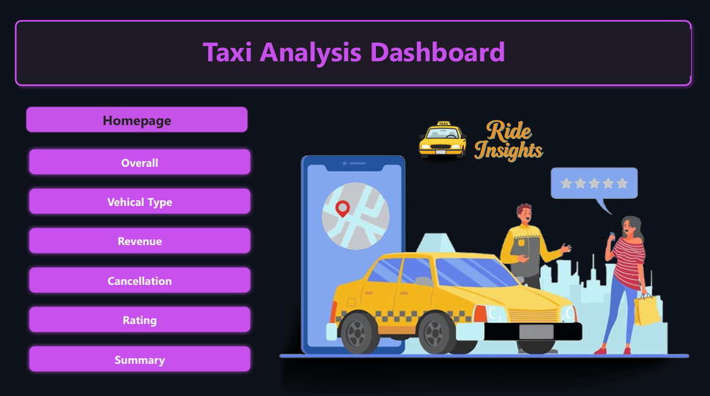
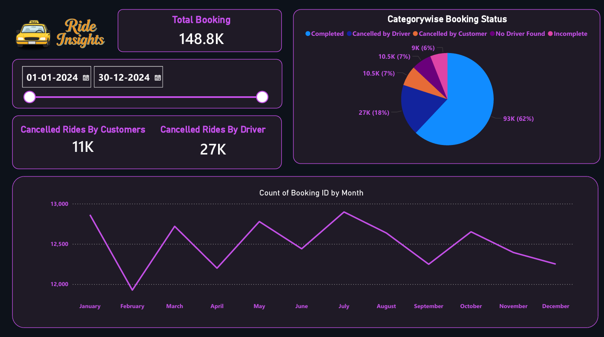
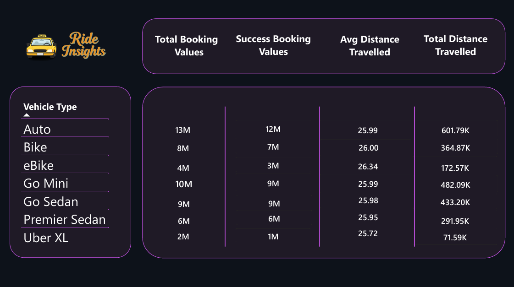
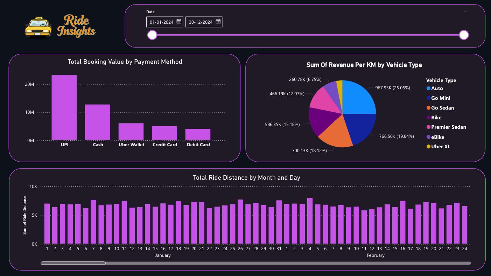
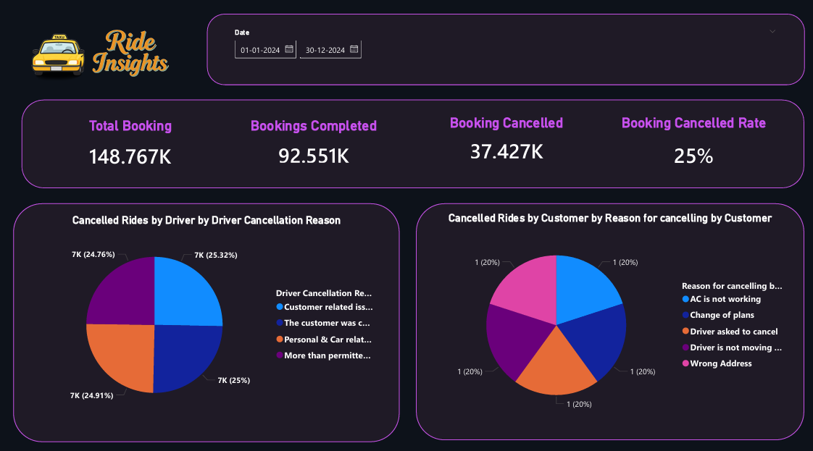
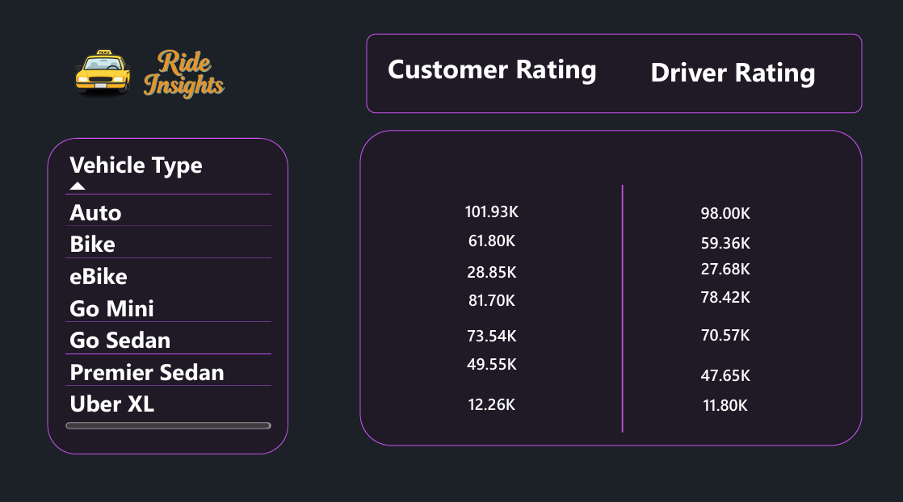
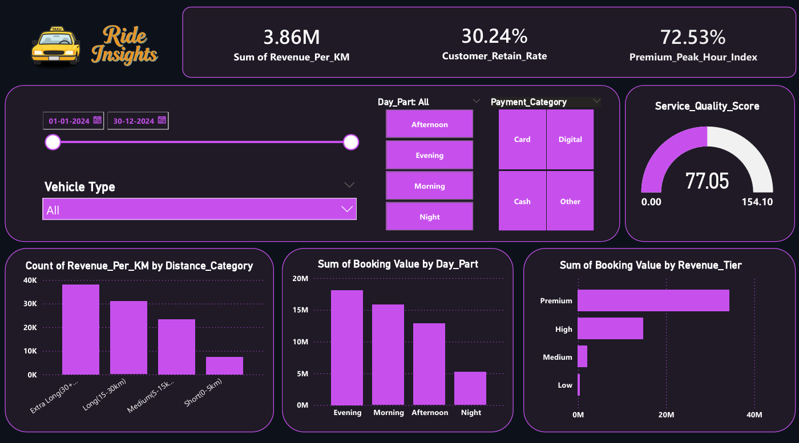

# 🚖 Taxi Booking Data Analysis Dashboard  
### Power BI Business Intelligence Project

An interactive Power BI dashboard analyzing taxi booking data to generate business insights related to revenue, cancellations, vehicle performance, and customer behavior.

---

## 📊 Project Overview

This project analyzes 2024 taxi booking data to:

- Monitor total bookings and completion rate
- Identify cancellation trends
- Analyze revenue performance
- Evaluate vehicle category efficiency
- Study customer and driver ratings

---

## 📁 Dataset

- File: rideBookings.csv
- Period: Jan 2024 – Dec 2024
- Records: 148K+ bookings

---

## 📌 Key KPIs

- Total Bookings: 148.7K
- Completed Bookings: 92.5K
- Cancellation Rate: 25%
- Customer Retention Rate: 30.24%
- Revenue per KM: 3.86M

---

## 📈 Dashboard Insights

### 1️⃣ Booking Trend Analysis
Monthly booking trends and ride distance tracking.

### 2️⃣ Revenue Analysis
Revenue breakdown by:
- Vehicle Type
- Revenue Tier
- Payment Method
- Day Part

### 3️⃣ Cancellation Analysis
Detailed breakdown:
- Customer cancellation reasons
- Driver cancellation reasons

### 4️⃣ Distance Category Analysis
Revenue and count by:
- Short
- Medium
- Long
- Extra Long

### 5️⃣ Ratings Analysis
Comparison of:
- Customer ratings
- Driver ratings

---

## 🛠 Tools Used

- Power BI
- DAX
- Data Modeling
- KPI Dashboard Design

---

## 📸 Dashboard Preview

---

## 🎯 Skills Demonstrated

- Data Cleaning & Transformation
- DAX Measures & Calculated Columns
- Business KPI Modeling
- Interactive Dashboard Design
- Insight Generation

